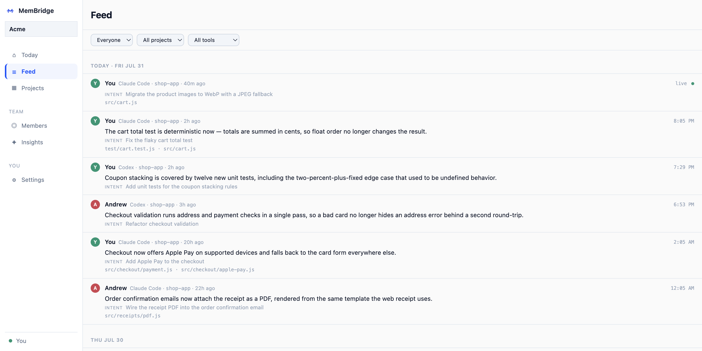
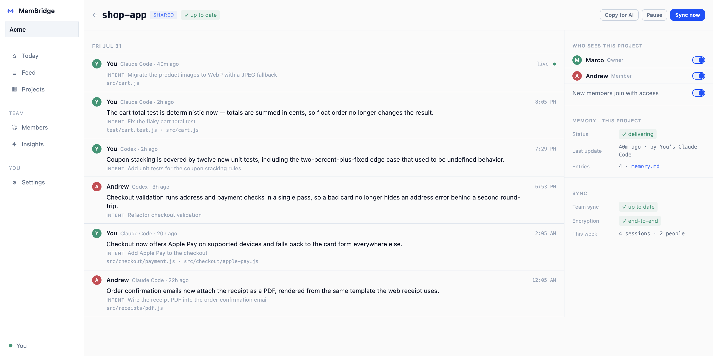

<p align="center">
  
</p>

<h1 align="center">MemBridge</h1>

<p align="center">
  <b>Shared memory for Claude Code, Codex, Cursor and the other AI coding agents on your team.</b><br>
  <sub>Your teammates' agents already know what yours figured out.</sub>
</p>

<p align="center">
  <a href="https://github.com/MembridgeAi/membridge/actions/workflows/ci.yml"></a>
  <a href="https://www.npmjs.com/package/@membridgeai/membridge"></a>
  <a href="package.json">= 18"></a>
  
  
  <a href="LICENSE.md"></a>
</p>

<p align="center">
  <a href="#the-hand-off">Live hand-off</a> ·
  <a href="#three-moments-one-of-them-is-ours-alone">How it works</a> ·
  <a href="#ask-the-question-youd-have-interrupted-someone-with">Team search</a> ·
  <a href="#the-app">The app</a> ·
  <a href="#privacy">Privacy</a> ·
  <a href="docs/guide.md">Docs</a> ·
  <a href="https://membridge.app">membridge.app</a>
</p>

---

MemBridge is a menu-bar app and CLI for teams that code with AI. A local
daemon watches the session logs your tools already write, distills each one
into a per-project memory, and gets it to everyone else's agents: at startup,
mid-session, and on demand over MCP.

```sh
curl -fsSL https://membridge.app/install.sh | sh
```

<p align="center"><sub><code>local-first · no account · no API keys · about two minutes</code></sub></p>

<p align="center"><sub>The one-liner is macOS (Apple Silicon). Everywhere else: <code>npm i -g @membridgeai/membridge &amp;&amp; membridge start</code>. See <a href="#install">Install</a>.</sub></p>

<br>

## The hand-off

When Andrew's Codex refactors checkout validation, a redacted digest syncs to
the team. Next time you open the project, your Claude Code already knows.


> ### Why this is worth a daemon
>
> We measured what re-orientation costs. Across **6,104 real agent sessions
> from 310 developers**, the median developer spends **31% of their tokens**
> getting an agent back up to speed in code it has already seen.
>
> From [The Context Ledger](https://membridge.app/context-ledger/), our open study

<br>

## Three moments, one of them is ours alone

Most memory tools stop at writing a file. The useful part is what happens
*after* the session has already started, and months later when nobody
remembers who made the call.

| When | What happens |
| :-- | :-- |
| **01 · At startup**<br><sub>Every session opens briefed</sub> | What the team's agents worked out is written into the instruction files your agents already read: `CLAUDE.md` and `AGENTS.md`, plus `GEMINI.md` and others if you turn them on. Attributed by person, so nobody writes a doc and nobody re-explains the architecture. |
| **02 · Mid-session**<br><sub>Nobody else does this</sub> | Your agent opens a file a teammate's agent made a call about, and that call enters the *running* session. Once, at the moment it matters, with nobody relaying it. |
| **03 · On demand**<br><sub>Scoped to your team's real work</sub> | A ranked search over what every agent on the team has done, exposed over MCP so any agent can query it directly. The useful answer is usually months old. |

<br>

## A memory block, between markers

MemBridge owns only what sits between its markers. The rest of your file is
never touched, and removing the block restores the file exactly.

```markdown
<!-- membridge:begin -->
## Project memory · updated 2h ago
checkout retries cap at 3 with exponential backoff (validate.ts)
payment webhooks replay from stripe-cli in dev, never mocked
e2e tests need POSTGRES_ISOLATION=strict or they flake              ← new
andrew owns the pricing service; ask before touching rate tables    ← new
<!-- membridge:end -->
```

<br>

## Ask the question you'd have interrupted someone with

`search_memory` searches the full entries, not a digest of them. It ranks
across the decisions people made, the gotchas they hit, what they were trying
to do and the files they touched, weighting a decision someone wrote down above
prose harvested from a transcript. Filter by teammate, project, file or date,
across your team's whole synced history.

```
search_memory("auth rotation")                                    · via MCP
3 results from 2 teammates, across 4 months

  Priya settled this on 14 June.
  JWT rotation happens in vault, never in app config. The app-config path
  was tried in March and reverted after an incident. Marcus then moved
  session refresh behind the gateway so the SDK never sees a raw token.
  You tried per-service key caching in May and abandoned it, because
  rotation invalidation got unmanageable.
```

Ranked by relevance, not recency, so work from months ago surfaces when it
answers the question.

**Provenance, too.** `membridge why <file>` lists the AI sessions that edited a
file, newest first; add `:<line>` to trace a single line to the one session
behind it.

```
$ membridge why lib/teamsync.js
Why lib/teamsync.js: 2 session(s), newest first:

2026-07-29 09:14 · marco · Claude Code
  Ask: Find out why team sync is broken and fix it
  Did: Rows are deduped inside upsertEntries, so one self-conflicting
  pair can no longer black out all teammate activity.
```

<br>

## The app

What the team looks like from the outside: every agent session, who can see
which project, and where knowledge is concentrated in one person's head.

<p align="center">
  
</p>

<p align="center">
  
</p>

<br>

## Supported tools

| Tool | Support | How |
| --- | --- | --- |
| **Claude Code** | Built in | Reads `~/.claude/projects` transcripts, writes `CLAUDE.md` |
| **Codex** (OpenAI) | Built in | Reads `~/.codex/sessions` rollouts, writes `AGENTS.md` |
| **Gemini CLI** | Custom adapter | Point an adapter at its logs, add `GEMINI.md` to targets |
| **Cursor, opencode, Copilot CLI, …** | Custom adapter | Any tool that logs sessions as JSONL. No code required |
| **Claude Desktop, and any MCP client** | Built in | `membridge mcp`, registered automatically at install |

One memory across all of them, so switching tools mid-task doesn't reset
anything. Adapter config is in [the guide](docs/guide.md#supported-tools).

Capture depth varies by tool. Claude Code's Stop hook can hold a session
open long enough for the agent to write a summary on purpose. Everywhere
else, Codex included, MemBridge harvests one from the last chat message
instead. That carries what the session concluded, but not the separate
intent, decisions and gotchas. See
[session summaries](docs/guide.md#session-summaries).

<br>

## Privacy

Your work stays local. No cloud, no account, no API keys until you join a
team, and the team layer is opt-in per project.

- **End-to-end encrypted.** Your asks, summaries, decisions, gotchas, file paths
  and change notes are secretbox-encrypted with a per-team key sealed to each
  member's public key, so the server stores ciphertext it cannot open. Private
  keys never leave the macOS Keychain.
- **Routing details stay readable** so sync and access control can work: project,
  timestamp, session, which AI tool, and your display name. The content is what
  gets encrypted. The [encryption spec](docs/ENCRYPTION-SPEC.md) §0.1 lists the
  exact fields.
- **Fail-closed.** When encryption can't run, sync **holds and pauses** rather
  than degrading to plaintext.
- **Secret redaction.** AWS, GitHub, Google, Slack, OpenAI and Anthropic keys,
  tokens and private paths are scrubbed before anything leaves your machine.
- **Your verbatim prompts stay on your machine.** A new install shares a
  scrubbed one-line goal per session and nothing else of what you typed;
  `membridge team share-prompts off` stops that too. Your source code is never
  transmitted, only distilled summaries.
- **Per-project access control**, roles (owner / admin / member), and a 30-day
  audit trail. Tick a cell to grant or revoke. Project access is enforced by
  server-side database rules, **not** by encryption — one team key spans every
  project, so revoking a project does not withhold a key. Removing someone from
  the **team** is different and does rotate the key. [Spec §0.2–0.3](docs/ENCRYPTION-SPEC.md).

Two things do leave the machine without team sync. MemBridge sends anonymous
usage counters tied to a random install id, and asks GitHub every six hours
whether a newer release exists. The counters carry no code, file names, project
names or account. Turn them off with `MEMBRIDGE_NO_DIAGNOSTICS=1` or
`diagnostics.enabled: false` in your config.

<br>

## Install

| Platform | How |
| --- | --- |
| **macOS** (Apple Silicon) | `curl -fsSL https://membridge.app/install.sh \| sh` (installs the menu-bar app) |
| **macOS** (Intel), **Windows**, **Linux** | `npm i -g @membridgeai/membridge && membridge start` |
| **Headless / CI boxes** | Same npm install; `membridge start` runs the daemon and serves the full dashboard at `127.0.0.1:7437` — reach it over an SSH port-forward (`ssh -L 7437:127.0.0.1:7437 <box>`) or stick to the CLI |

Then `membridge status` to confirm, or open the dashboard at
`http://127.0.0.1:7437`. `membridge enable-autostart` makes it run at login.

<details>
<summary><b>The CLI, in full</b></summary>

<br>

The app and the CLI are the same daemon with the same features, so headless
boxes and terminal-first teammates aren't second-class.

| Command | What it does |
| --- | --- |
| `membridge start` / `stop` / `status` | Manage the background daemon |
| `membridge dashboard` | Open the web UI at `http://127.0.0.1:7437` |
| `membridge sync [--dry-run] [--project <path>]` | One sync pass right now |
| `membridge scan` | Read-only report of discovered tools and projects |
| `membridge remove [--project <path>] [--keep-memory]` | Strip injected memory blocks **and permanently delete that project's local `.membridge/` history** (irreversible); `--keep-memory` strips the blocks only. Local data only — it does not delete entries already synced to a team |
| `membridge enable-autostart` / `disable-autostart` | Run at login |
| `membridge setup-hooks` / `remove-hooks` | Session summary + recall hooks |
| `membridge git-filter <on\|off\|status>` | Keep the injected block out of git (on by default, set up by `setup-hooks`) |
| `membridge signup` / `login` / `logout` | Team account |
| `membridge join <link-or-code>` | Accept an invite (creates the account if needed) |
| `membridge team create` / `invite` / `revoke-invite` | Create a team, manage invites |
| `membridge team link` / `unlink` / `list` | Share or stop sharing a project |
| `membridge team setup` | Point at a self-hosted backend |
| `membridge why <file>[:<line>]` | Which AI sessions edited a file, newest first |
| `membridge churn [--session <id>] [--since <Nd>]` | Diagnostic: how much of a session's committed work survives in `HEAD` |
| `membridge mcp` | Read-only MCP server over stdio |

</details>

<details>
<summary><b>FAQ</b></summary>

<br>

**Do I need the terminal?** No. Installing, creating a team, inviting, sharing
projects, and every setting are in the UI. The CLI exists for Linux, headless
machines, and people who prefer it.

**Do I need an account or API key?** Only for the team layer (an account).
Syncing your own tools with each other needs neither, and never touches the
network.

**Will it mess up my existing `CLAUDE.md` / `AGENTS.md`?** No. Only the content
between the `<!-- membridge -->` markers is rewritten, and removing the block
restores your file exactly.

**Won't the block churn my git history?** No. `membridge setup-hooks` installs
a git *clean filter* that strips the block on the way into the index, so it
never reaches a commit: `git diff` is empty for it and a merge cannot conflict
on it, while the file on disk keeps the block for your AI tools. Your own lines
in the file are tracked exactly as before. Teammates without MemBridge are
unaffected, because git ignores a filter it has no config for. Turn it off with
`membridge git-filter off`. Two things to know: `git status` may still mark the
file when a rewrite changes its byte length (git compares sizes there, not
content, so the diff stays empty and the next `git add` clears it), and a
checkout that rewrites a context file leaves it blockless until the next sync.

**Does my whole team need it installed?** Everyone whose AI activity should
sync runs MemBridge. People who just want to watch can use the web workspace
from a browser.

**How much overhead does it add?** It reads only the bytes appended since the
last pass and sleeps between syncs (60s default). Four runtime dependencies:
encryption (`libsodium-wrappers`), code parsing (`web-tree-sitter`), and the
MCP server (`@modelcontextprotocol/sdk`, `zod`).

**What happens when someone leaves?** Remove them in Members. That rotates the
team key to a new epoch sealed only to the remaining members, so they cannot
read anything written afterwards — this one is enforced by cryptography, not
just by a server check. Rotation is forward-only: history they already synced
stays readable to them, because no rotation can undo a copy someone already
holds. Their past contributions stay with the team.

Removing someone from a single **project** while they stay on the team is a
weaker, server-side guarantee — one team key spans every project, so there is no
key to withhold. See the [encryption spec](docs/ENCRYPTION-SPEC.md) §0.2.

</details>

<br>

## Docs

**[The full guide →](docs/guide.md)** covers install options, the dashboard
tour, session summaries and the Stop hook, team sync and privacy, self-hosting,
configuration, custom adapters, and development docs.

- [Encryption spec](docs/ENCRYPTION-SPEC.md) · [Auth setup](docs/AUTH-SETUP.md) · [Changelog](CHANGELOG.md)
- [The Context Ledger](https://membridge.app/context-ledger/), the study behind the 31% number
- This page also has an animated twin at [docs/readme.html](docs/readme.html)

## Contributing

Issues and PRs welcome. `npm test` runs the suite; please keep it green.
Node ≥ 18.

---

<p align="center">
  <sub>Built by <a href="https://github.com/MembridgeAi">Andrew Brown &amp; Marco Melika</a> · source-available under <a href="LICENSE.md">FSL-1.1-ALv2</a> (Apache 2.0 after two years) · <a href="https://membridge.app">membridge.app</a></sub>
</p>
