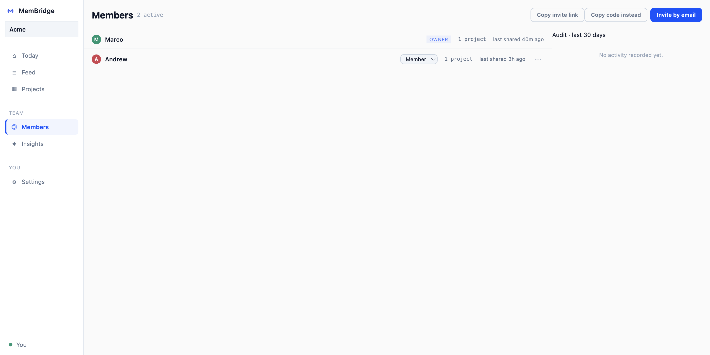

# The MemBridge guide

The full manual: installing, the dashboard, how sync works, session
summaries, team sync and privacy, roadmaps, the CLI, supported tools,
configuration, FAQ, and development. For the short version, start at the
[README](../README.md).

MemBridge is a menu-bar app (and CLI) for teams that code with AI. It gives
you one feed of what everyone's AI coding tools have been doing, and it keeps
the tools themselves in sync: Claude Code, Codex, Gemini CLI and any other
agent can see each other's recent work, across tools and across teammates.


When Andrew's Codex refactors checkout validation, you see it in the feed,
and your Claude Code knows about it the next time you open the project.

Three things happen under the hood:

- A local daemon watches the session logs your AI tools already write to
  disk, and distills them into a small per-project memory.
- That memory is injected into the context files every tool already reads at
  startup (`CLAUDE.md`, `AGENTS.md`, `GEMINI.md`), inside a clearly marked
  block. Your own notes are never touched.
- Optionally, a redacted digest of that memory syncs to your team, so
  everyone's dashboard (and everyone's agents) can see what happened in
  shared projects.

Everything starts local: no cloud, no accounts, no API keys until you decide
to connect a team.

## Install

macOS (Apple Silicon), one command:

```sh
curl -fsSL https://membridge.app/install.sh | sh
```

This installs `MemBridge.app` to `/Applications` and the `membridge` CLI to
`/usr/local/bin` (that step may ask for your password once), verifies the
download's SHA-256, and launches without a Gatekeeper warning (the app is
signed and notarized with Apple). Want to read
it first? `curl -fsSL https://membridge.app/install.sh -o install.sh`.

On Intel Macs, Linux, Windows, or servers, use the CLI instead:

```sh
npm install -g @membridgeai/membridge
membridge scan       # read-only: see which AI tools and projects it found
membridge start      # run the background daemon
membridge dashboard  # open the dashboard at http://127.0.0.1:7437
```

That's the zero-setup core: your own tools start seeing each other's work,
and the dashboard fills with your sessions. No account needed for any of it.

To add your team: click **Invite** in the header (sign up, create the team,
share the invite link), have teammates join and install, then share a project
from its page. Commit the resulting `.membridge/team.json` so teammates'
clones connect too. Terminal folks: `membridge join <link>` does signup and
join in one command.

## The dashboard

The app has six screens: Today, Feed, Projects (plus each project's own
page), Members, Insights, and Settings.

**Today** is the landing screen: live session intent rows and per-project
metrics at a glance. **Feed** is the merged activity stream, one entry per
session, leading with the outcome and the original prompt underneath as an
`Intent` line. Filter by person, project, or tool. **Projects** lists what
MemBridge is watching, local-only or shared, with a week of stats per
project.

Open a project and you get its own merged stream: your sessions and your
teammates', interleaved, plus an access panel for who can see it. That panel is
enforced by server-side database rules rather than by encryption — one team key
spans every project, so unticking someone here stops the server serving them the
project, but does not take a key away from them. Removing someone from the
**team** is the stronger operation: it rotates the key so they cannot read
anything written afterwards. The
[encryption spec](ENCRYPTION-SPEC.md) §0.2–0.3 spells out both.


The **Copy for AI** button on a project page puts a trimmed, redacted digest
on your clipboard, for pasting into ChatGPT, claude.ai, or any web AI that
can't see your disk.

**Members** handles roles, invites, and the audit trail; **Insights** aggregates
team *activity* — sessions and summaries per person, which projects are busiest,
how concentrated knowledge is, and what looks silently broken, in severity
tiers. Both are team-only; a solo install never shows them.

**Insights does not show team-wide token savings, and cannot.** A teammate's
token counts live on their machine; the team sync moves ciphertext and carries
no token figures by design, so no server-side component can compute a team,
per-seat or per-person savings number. The savings figures anywhere in the app
are **your own machine's ledger** — including "times memory helped" on the
Insights page, which is this install's cumulative count, not the team's.



## How it works

Every AI coding assistant keeps its own siloed session history. Claude Code
doesn't know what Codex did this morning; your Codex has no idea what your
teammate's Claude Code shipped an hour ago.

But every major tool already reads a per-project context file at startup,
and writes its session transcripts to a known folder on disk. MemBridge's
daemon connects the two:

```
Claude Code ─┐                          ┌─> CLAUDE.md   (read by Claude Code)
Codex ───────┼─> per-project shared ────┼─> AGENTS.md   (read by Codex & most agents)
any tool ────┘        memory            └─> GEMINI.md…  (configurable)
                        ⇅
      team sync (opt-in, redacted): your teammates' MemBridge daemons
```

The injected block looks like this (taken from a real project):

```markdown
<!-- membridge:begin -->
## Shared AI memory (MemBridge)

Recent asks across tools:
- 2026-07-21 16:02 · Claude Code
  Intent: Fix the flaky cart total test
  Did: The cart total test is deterministic now: totals are summed in
  cents, so float order no longer changes the result.
  Changes: src/cart.js · test/cart.test.js
- 2026-07-21 17:34 · Claude Code: Migrate the product images to WebP

Teammates' AI activity (MemBridge team sync):
- 2026-07-21 14:43 · Andrew · Codex: Refactor checkout validation
  Did: Checkout validation runs address and payment checks in a single
  pass, so a bad card no longer hides an address error.

Files recently modified by AI tools: src/cart.js, test/cart.test.js
<!-- membridge:end -->
```

Only the content between the markers is ever rewritten. The **Remove block**
button strips it cleanly and restores your file byte-for-byte, and leaves your
local memory alone.

`membridge remove` does the same to the block, but it *also* permanently
deletes that project's `.membridge/` folder — its whole local memory history,
which nothing rebuilds. Use `membridge remove --keep-memory` if you only want
the blocks gone.

> **These delete local data only.** `membridge remove`, the **Remove block**
> button, and the project Delete dialog all act on this machine: the
> `.membridge/` folder, the injected blocks, and the local team-archive cache.
> **None of them removes entries you have already synced to a team backend.**
> Archiving a shared project archives it; it does not delete the rows.
>
> **There is currently no way for you to delete your own synced team entries.**
> The daemon has the endpoints and the database has the deletion function, but
> nothing in the app or the CLI calls them yet, so there is no button and no
> command to point you at. Until that ships, removing your synced entries means
> asking a team owner. This is a known gap, stated here rather than glossed —
> if you need your data gone before it lands, say so and it will be done by
> hand.

Each project also gets a structured memory database in `.membridge/`:
`memory.json` (every update as a structured entry, plus an ignore-aware index
of the project's files) and `memory.md` (the same memory as readable
markdown). Add `.membridge/` to `.gitignore` if you don't want it committed,
or commit it to share AI context with your whole team.

## Session summaries

A summary harvested from the agent's last chat message is decent; a summary
the agent writes on purpose is better. The app asks once, on first run,
whether to turn this on (Settings toggles it any time; CLI:
`membridge setup-hooks` / `remove-hooks`).

Enabled, it registers a [Stop hook](https://docs.claude.com/en/docs/claude-code/hooks)
in `~/.claude/settings.json`. When a Claude Code session that edited files
tries to stop, the hook blocks the stop once and asks the agent to append
one JSON line to `<project>/.membridge/summaries.jsonl`: what was asked,
what changed, key decisions, surprises. These become Codex summary entries
that take precedence everywhere: the context block, `memory.md`,
the Copy-for-AI digest, and the team feed. The feed your teammates read is
written by the agent that did the work.

Long sessions get checkpoints rather than one shot: the hook re-asks every
so many edits (defaults: first summary after 1 edit, then every 12), and the
newest line wins while `memory.md` keeps the full history. Only that newest
line is ever displayed or shared, so the re-asks exist mainly so a session
that dies without a clean stop still leaves a recent summary behind. Lower
`checkpointEvery` for fresher checkpoints, raise it for fewer interruptions. The hook is
strictly fail-open: any error, a paused project, or a too-small session
means Claude Code stops normally. Nothing is installed silently, and
turning it off removes exactly what was added.

Codex and other `AGENTS.md` readers have no hook, so the injected block
carries a standing instruction to append the same line on completion.
Well-behaved agents comply; when they don't, MemBridge falls back to the
harvested summary.

## Memory in front of a search

Session summaries answer "what happened". This is the other direction: when
an agent starts digging through a tracked project, MemBridge's memory of the
same ground is put in front of it before the search runs.

`setup-hooks` registers a second [PreToolUse hook](https://docs.claude.com/en/docs/claude-code/hooks)
on `Grep` and `Glob`. The search pattern is reduced to the words a person
actually meant (regex and glob syntax is stripped), those words are run
through the same relevance ranking `search_memory` uses, and up to three
matching past sessions -- yours and your teammates' -- are handed to the
agent alongside its results. It never answers or blocks the search: the Grep
runs exactly as written, with the memory beside it.

It is deliberately quiet. A pattern with nothing specific in it is rejected
before anything is read from disk, a search with no relevant memory prints
nothing at all, and memory already given to a session is never repeated in
it. The injected block is hard-capped so it stays a small fraction of the
search results it rides on. Like every other hook here it is strictly
fail-open, and a paused or excluded project is skipped entirely.

This one is Claude Code only, because it is the only tool with a hook that
fires before a search. Codex and other `AGENTS.md` readers are covered the
same way they are for summaries: by the standing instruction in the injected
block.

## Team sync and privacy

What leaves your machine, and only for projects you explicitly share: the
same redacted digest entries you see in `.membridge/memory.md`. Timestamps,
tool names, redacted asks, relative file paths. Never file contents, never
unshared projects. Row-level security limits every row to your team.

The daemon binds to `127.0.0.1` only. Three things do call home, and it is
worth being precise about each:

- **Anonymous usage counters** ([`lib/counters.js`](../lib/counters.js)).
  The daemon sends a small set of product-health counters to a stats
  endpoint (a Cloudflare Worker, deliberately separate from the database
  that holds team data): a heartbeat, whether recall is serving, whether
  your checkouts are worktrees, whether hook registration succeeded, and
  which of the built-in MCP tools have been used. Every value is drawn
  from a fixed allowlist; paths, repo names, file names, content, and
  account data structurally cannot ride along. Sent at most once per day,
  or when one of those states changes.
- **A one-time failure diagnostic** ([`lib/diagnostics.js`](../lib/diagnostics.js)).
  If recall goes net negative on tokens for a project, recall is paused
  for that project and one anonymous payload is sent so the failure mode
  can be studied across installs: version, token counters, an acceptance
  ratio, and per-language counts of cached files. No code, no file names,
  no project names.
- **An update check** ([`lib/update-check.js`](../lib/update-check.js)).
  At most every 6 hours, MemBridge asks GitHub's public releases API
  for the latest version tag. A plain unauthenticated GET; nothing about
  you or your install is sent beyond the request itself.

The first two are keyed by an `install_id`: a random UUID generated once
on your machine, fed by nothing machine- or person-identifying. Both obey
the same two switches, and either one turns them both off: set
`"diagnostics": { "enabled": false }` in `~/.membridge/config.json`, or set
`MEMBRIDGE_NO_DIAGNOSTICS=1` in the environment. The update check has no
dedicated off switch; the automatic check runs only when the desktop app
launches, and every other check happens when you ask for one (the "Check
for updates" menu item, `membridge update`).

The only files
MemBridge writes are the context files (inside its own markers) and its own
state in `~/.membridge`; transcripts are read incrementally and never
modified.

MemBridge also keeps a durable local archive of teammate activity, one file
per shared project under `~/.membridge/team-archive/`. The working cache
only holds each project's newest entries (under a week's worth for a busy
five-person team), so once an entry aged out of the cache it used to be
gone for good; now every pulled entry is appended to the archive too, and
the daemon walks backward through history, keeping a large but bounded
window of the team's past activity (the archive caps out at 5,000 entries
per project, plenty for search but not literally everything since day
one for a large, long-running team). The archive lives in the same trust
boundary as everything else here, same machine and same account, and is
redacted at every read, never trusted as already-clean at rest.

Secrets are redacted before any text leaves a transcript, in every path
(context blocks, memory files, Copy-for-AI, roadmap prompts, team sync).
The built-in patterns cover AWS/GitHub/Google/Slack/Anthropic/OpenAI key
formats, JWTs, PEM blocks, credentials in connection URIs,
`Authorization`/`Bearer` headers, and `password=`/`api_key:` assignments,
plus a Shannon-entropy backstop for high-entropy blobs that match no known
shape. Each match becomes a named `[redacted:<name>]` marker. Add your own
patterns with `redact`/`redactExtra` in config.

Be clear about the limits: regex-and-entropy redaction cannot recognize
every secret shape. It's defense in depth, not permission to paste live
credentials into AI sessions. Use `exclude` or a `.membridge-off` file for
projects that handle sensitive material.

<details>
<summary>Running your own backend (self-hosting)</summary>

Team sync talks to a Supabase project. Official builds ship pointed at the
hosted backend ([`lib/backend.json`](../lib/backend.json)), so users configure
nothing. To run your own:

1. Create a [Supabase](https://supabase.com) project (free tier is plenty),
   and run [`supabase/schema.sql`](../supabase/schema.sql) plus the files in
   [`supabase/migrations/`](../supabase/migrations) in its SQL Editor.
2. Grab the Project URL and `anon` key from Settings → API (both are safe to
   publish; row-level security protects the data).
3. Bake them into `lib/backend.json` before building, or point an install at
   them: `membridge team setup --url https://<ref>.supabase.co --anon-key <key>`
</details>

## Roadmaps (optional, bring your own key)

The free core never calls any API. Add your own Anthropic key in Settings
and each project page grows a roadmap generator: describe what you want to
build, see the estimated cost on the button (about 1¢ with the default
model), and get a phased plan where every task names the AI model suited to
it, from everyday Haiku work up to frontier Fable work, with a cross-check
task for a second tool. The plan is saved to `.membridge/plan.json` and one
`Current roadmap:` line joins the shared memory block, so your agents see
the plan too.

What's sent with your key, only when you click Generate: project name, your
goal, recent asks (already redacted), file paths, and top-level folder
names. Never file contents.

## The CLI

The app and the CLI are the same daemon with the same features, so headless
boxes and terminal-first teammates aren't second-class:

| Command | What it does |
| --- | --- |
| `membridge start` / `stop` / `status` | Manage the background daemon |
| `membridge dashboard` | Open the web UI at `http://127.0.0.1:7437` |
| `membridge sync [--dry-run] [--project <path>]` | One sync pass right now |
| `membridge scan` | Read-only report of discovered tools and projects |
| `membridge remove [--project <path>] [--keep-memory]` | Strip injected memory blocks **and delete `.membridge/` local memory history** (irreversible); `--keep-memory` strips the blocks only |
| `membridge enable-autostart` / `disable-autostart` | Run at login |
| `membridge setup-hooks` / `remove-hooks` | Session summary hook |
| `membridge signup` / `login` / `logout` | Team account |
| `membridge join <link-or-code>` | Accept an invite (creates the account if needed) |
| `membridge team create` / `invite` / `revoke-invite` | Create a team, manage invites |
| `membridge team link` / `unlink` / `list` | Share or stop sharing a project |
| `membridge team setup` | Point at a self-hosted backend |
| `membridge why <file>[:<line>]` | Which AI sessions edited a file, newest first; `:<line>` narrows to one line |
| `membridge churn [--session <id>] [--since <Nd>]` | Diagnostic: how much of a session's committed work survives in `HEAD` |
| `membridge mcp` | Read-only MCP server over stdio |

Run inside a tracked project, `membridge why` traces a file back to the AI
sessions that edited it:

```
$ membridge why lib/teamsync.js
Why lib/teamsync.js — 2 session(s), newest first:

2026-07-29 09:14 · marco · Claude Code
  Ask: Find out why team sync is broken and fix it
  Did: Rows are deduped inside upsertEntries, so one self-conflicting
  pair can no longer black out all teammate activity.
```

Add `:<line>` (as in `membridge why lib/teamsync.js:214`) and git blame
narrows it to the single session behind that line; a line git cannot
attribute (uncommitted, a merge commit, no local attribution) falls back
to the file-level history with an explicit reason. `membridge churn` is
the companion diagnostic: for one session (the most recent, by default)
or a `--since <Nd>` window, it reports what fraction of the committed
lines still survive in `HEAD`. It is a rework health signal, never a
target, and by design it has no per-person option.

`membridge mcp` exposes the shared memory as read-only MCP tools
(`list_projects`, `get_project_memory`, `get_recent_activity`,
`search_memory`, `why`, and `recall`) for Claude Desktop, Cursor, and
other MCP clients. `search_memory` is relevance-ranked, not a plain keyword
match: it scores headlines, decisions, gotchas, goals, files touched,
per-file change notes, prompts, and summaries, and each result carries a
relevance score plus which fields matched. It's deliberately not
recency-weighted, so work from months ago still surfaces when it's the
best match; teammates re-covering old ground is exactly what it's for.
Narrow it with optional `author`, `project`, `file`, `tool`, and
`since`/`until` filters (a bare date like `2026-06-01` includes that whole
day). It also reaches the durable team archive described above, so it can
answer questions about work outside the recent-activity window;
`get_recent_activity` intentionally skips the archive to keep its payload
small. `why` traces a file (or a single line) back to the session that
touched it, and `recall` returns a cached structural skeleton of a tracked
file. Nothing any of these tools expose can write files or trigger sync,
and every field passes through the same redaction as the context files.
The MCP SDK ships with MemBridge, so there is nothing extra to install.
Point your client at `{ "command": "membridge", "args": ["mcp"] }`.

## Supported tools

| Tool | Support | How |
| --- | --- | --- |
| Claude Code | Built in | Reads `~/.claude/projects` transcripts, writes `CLAUDE.md` |
| Codex (OpenAI) | Built in | Reads `~/.codex/sessions` rollouts, writes `AGENTS.md` |
| Gemini CLI | Custom adapter | Point an adapter at its logs, add `GEMINI.md` to targets |
| Cursor, opencode, Copilot CLI, … | Custom adapter | Any tool that logs sessions as JSONL, no code required |

A custom adapter is a config entry that tells MemBridge where a tool's JSONL
logs live and which fields hold the project path, timestamp, and message:

```jsonc
"custom": [{
  "id": "mytool",
  "displayName": "MyTool",
  "dir": "/home/me/.mytool/sessions",
  "fields": {
    "project": "dir",        // dot-path to the project path on each line
    "timestamp": "when",     // dot-path to an ISO timestamp
    "text": "say",           // dot-path to the user's message
    "role": "who",           // optional filter field...
    "roleValue": "user"      // ...and required value
  }
}]
```

Dot-paths reach nested fields (`payload.cwd`), and a project path that
appears only once per file (like Codex's `session_meta`) is carried forward
automatically.

## Configuration

Settings covers the common options. Under the hood it's
`~/.membridge/config.json`:

```jsonc
{
  "intervalSec": 60,                     // how often to sync
  "dashboardPort": 7437,
  "targets": ["CLAUDE.md", "AGENTS.md"], // add "GEMINI.md" etc.
  "exclude": ["C:\\work\\secret-project", "*archive*"],
  "redactDefaults": true,                // built-in secret redaction
  "redact": [],                          // your own regexes -> [redacted]
  "redactExtra": [],                     // additive, same syntax
  "maxPrompts": 8,
  "maxFiles": 10,
  "distill": { "enabled": true, "minEdits": 1, "checkpointEvery": 12 },
  "diagnostics": { "enabled": true },    // anonymous counters + failure diagnostics (see Team sync and privacy)
  "adapters": {
    "claude-code": { "enabled": true },
    "codex": { "enabled": true },
    "custom": []
  }
}
```

Telemetry switches: `"diagnostics": { "enabled": false }` turns off both
the anonymous usage counters and the failure diagnostics described in
[Team sync and privacy](#team-sync-and-privacy); setting
`MEMBRIDGE_NO_DIAGNOSTICS=1` in the environment does the same. Two more
keys exist for self-hosters: `countersUrl` and `diagnosticsUrl` override
the endpoints baked into a build, and setting either to an empty string
(`""`) is a deliberate opt-out for that endpoint alone.

To pause a single project, click Pause in the dashboard, or drop an empty
`.membridge-off` file in its root.

### If your team tracks `CLAUDE.md` in git

MemBridge rewrites its managed block in each target file whenever a project has
new agent activity. If that file is **tracked**, every rewrite leaves your working
tree dirty until you commit or discard it — and git commands that require a clean
tree will refuse:

```
$ git pull --rebase
error: cannot pull with rebase: You have unstaged changes.
error: please commit or stash them.
```

The merge you already landed upstream stays landed; only your local checkout is
left behind. Three ways to live with it, best first.

**1. Let git stash around the rebase for you (recommended).** git already does
exactly this, correctly:

```bash
git config --global rebase.autoStash true
```

`git pull --rebase` then stashes the block, rebases, and reapplies it. Your tree
comes back dirty afterwards, which is right — the block is still there. Nothing in
MemBridge needs changing, and unlike a background process doing the stashing, git
is the one holding the lock on your repo.

**2. Commit the block with your work.** It is generated, but it is also a real
description of what happened in the project, and committing it is what makes it
visible to teammates who do not run MemBridge.

**3. Point `targets` somewhere untracked.** Add the file to `.gitignore` and keep
your hand-written instructions in a file MemBridge does not manage — this repo
does exactly that, with rules under `.claude/rules/`:

```jsonc
{ "targets": ["MEMBRIDGE.md"] }   // and .gitignore MEMBRIDGE.md
```

**State the cost before you choose 3, because it is easy to miss:** teammates then
stop receiving synced context in the file their agents actually read. The whole
point of the block is that an agent picks it up at startup without being asked; a
gitignored target delivers that only on machines running MemBridge. If your team
shares instructions through a tracked `CLAUDE.md`, option 1 keeps both properties
and option 3 trades one away.

MemBridge does **not** need any of this while a git operation is mid-flight. A sync
that finds a rebase, merge, cherry-pick, revert or bisect in progress defers its
write to the next tick rather than dirtying a tree git is holding, and reports the
project as skipped with the reason until it can write. Nothing is lost: the project
stays marked as having pending work, so the next tick after the operation ends
writes everything that arrived during it.

## FAQ

**Do I need the terminal?** No. Installing, creating a team, inviting,
sharing projects, and every setting are in the UI. The CLI exists for
Linux, headless machines, and people who prefer it.

**Do I need an account or API key?** Only for the team layer (account) and
roadmaps (your own Anthropic key). Syncing your own tools with each other
needs neither, and never touches the network.

**Will it mess up my existing CLAUDE.md / AGENTS.md?** No. Only the content
between the `<!-- membridge -->` markers is rewritten, and removing the
block restores your file exactly.

**Does my whole team need it installed?** Everyone whose AI activity should
sync runs MemBridge. People who just want to watch can use the web
workspace from a browser.

**How much overhead does it add?** Near zero. It reads only the bytes
appended since the last pass, sleeps between syncs (60s default), and its
runtime dependency list is deliberately short: encryption
(`libsodium-wrappers`), code parsing (`web-tree-sitter`), and the MCP server
(`@modelcontextprotocol/sdk`, `zod`).

## Development

```bash
node test/run.js         # dependency-free offline suite (temp dirs + mock Supabase)
node test/run.js redaction   # one focused suite from test/suites/ (seconds)
npm run app              # run the tray app from source (Electron)
npm run dist:mac         # build the macOS menu-bar app
```

The test suite itself needs no test framework. It is plain Node with
`assert`, and it never touches the network. The runtime dependencies
(`libsodium-wrappers`, `web-tree-sitter`, `@modelcontextprotocol/sdk`, `zod`)
all arrive with a plain `npm install`; Electron is a devDependency used only
by the tray app. CI runs the suite on Linux, Windows, and macOS across Node
18/20/22.

The suite is fully offline: it runs in temp dirs and talks to mock backends
(`MEMBRIDGE_API_BASE`, `MEMBRIDGE_TEAM_URL`). To hack on the dashboard
against fake data without touching your real `~/.membridge`, use the
`MEMBRIDGE_HOME`, `MEMBRIDGE_CLAUDE_DIR`, `MEMBRIDGE_CODEX_DIR`, and
`MEMBRIDGE_PORT` env overrides, or run `node scripts/readme-demo.js`,
which builds a two-user demo team on port 7541 (it's how the screenshots
in this guide were made).

Code map: [`lib/scan.js`](../lib/scan.js) (adapters → events → sync),
[`lib/digest.js`](../lib/digest.js) (memory block + injection),
[`lib/memorydb.js`](../lib/memorydb.js) (per-project `.membridge/` DB),
[`lib/redact.js`](../lib/redact.js) (redaction pipeline),
[`lib/hooks.js`](../lib/hooks.js) + [`lib/consent.js`](../lib/consent.js)
(summary hook + consent),
[`lib/feed.js`](../lib/feed.js) (merge local + team activity),
[`lib/advisor.js`](../lib/advisor.js) (BYOK roadmaps),
[`lib/teamsync.js`](../lib/teamsync.js) (team sync against Supabase),
[`lib/server.js`](../lib/server.js) (local HTTP API, serves `ui/dist` at `/`),
[`ui/`](../ui) (the web UI itself, React + Vite; `cd ui && npm run dev` for a
hot-reloading copy against a running daemon, `npm run build` for the static
bundle `lib/server.js` serves),
[`bin/membridge.js`](../bin/membridge.js) (CLI).
The working plan is [PLAN.md](../PLAN.md); recent changes are in
[CHANGELOG.md](../CHANGELOG.md).

## Roadmap

Next up, in rough order:

- Presence ("Andrew's Claude Code is working in src/checkout right now")
- Web workspace parity with the desktop dashboard's team features
- LLM-powered summaries (optional API key)
- Import ChatGPT / claude.ai data exports
- First-class adapters for Gemini CLI, Cursor, opencode, Copilot CLI

## License

Source-available under the Functional Source License (FSL-1.1-ALv2); converts to Apache-2.0 two years after each release.
